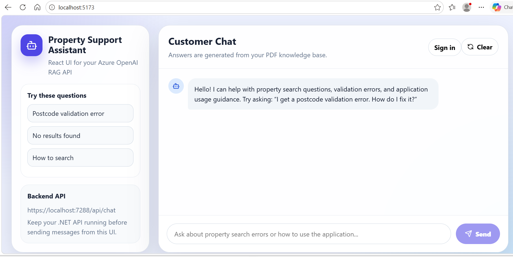
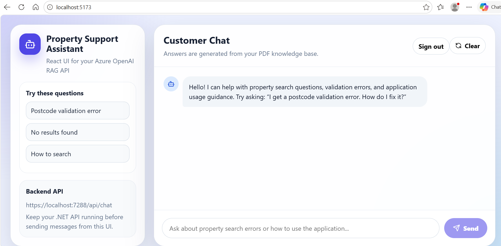
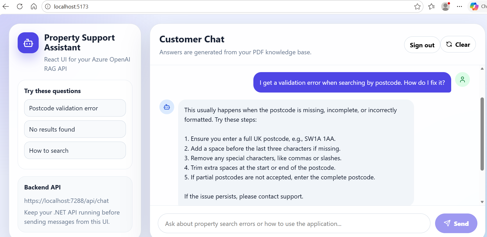
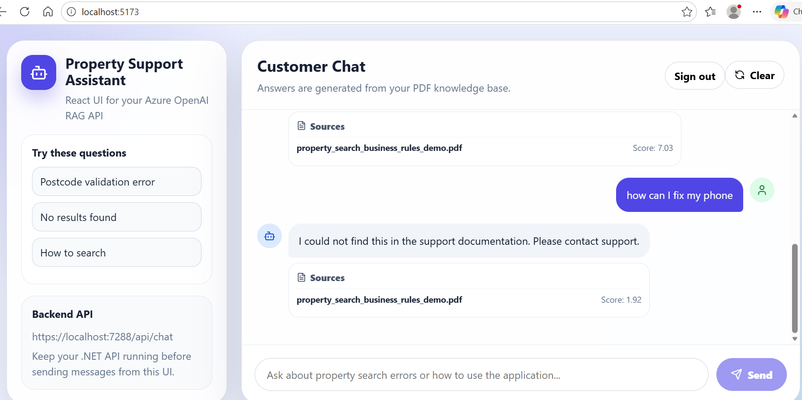
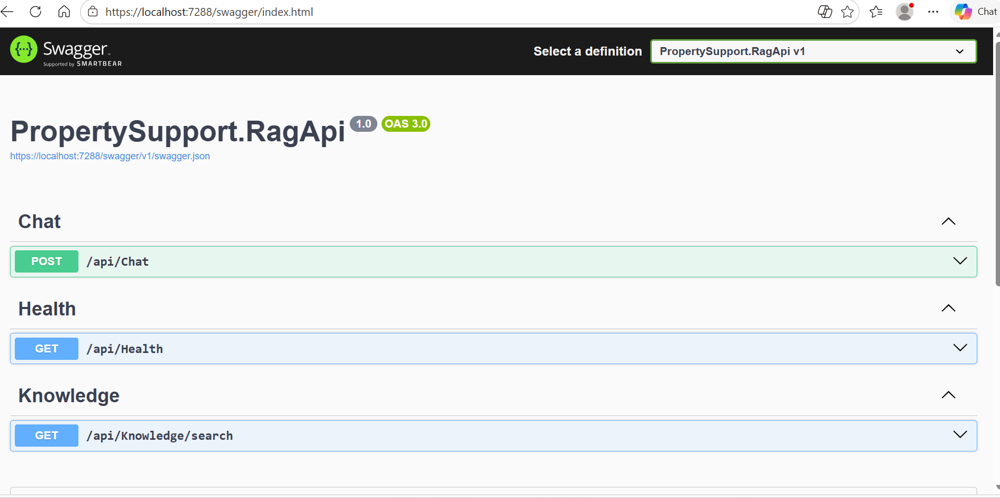
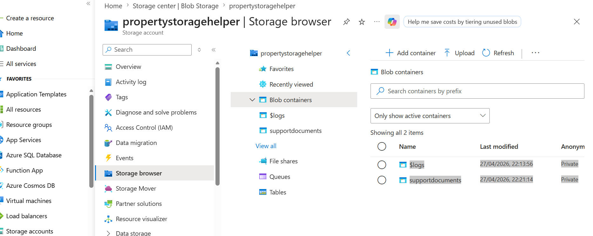
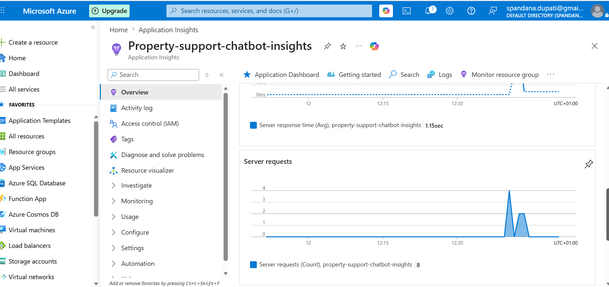

# Property Support Assistant

A simple **RAG-based customer support assistant** built with a **React frontend** and a **.NET backend**, powered by **Azure OpenAI** and Azure services.

The application answers property-support questions from uploaded support documents, returns grounded answers, and shows source references. It also handles unsupported questions gracefully.

---

## Project Overview

This project demonstrates how to build a practical support chatbot for a property-search domain.

Users can:
- ask questions in a chat interface,
- receive answers based on support documentation,
- view supporting source files,
- get a fallback message when the answer is not found in the knowledge base.

The solution combines:
- **React UI** for the chat experience,
- **ASP.NET Core Web API** for orchestration,
- **Azure OpenAI** for answer generation,
- **Azure Blob Storage** for document storage,
- **Application Insights** for monitoring,
- **Swagger** for API testing.

---

## Key Features

- Clean chat-based support UI
- Example prompts to guide the user
- Source citation display in responses
- Graceful fallback for unsupported or unrelated questions
- Health and knowledge endpoints in the backend API
- Azure-hosted monitoring and storage integration

---

## Tech Stack

### Frontend
- React
- TypeScript
- Modern responsive UI

### Backend
- C#
- ASP.NET Core Web API
- Swagger / OpenAPI

### Azure Services
- Azure OpenAI
- Azure Blob Storage
- Azure Application Insights
- Azure App Service

---

## API Endpoints

The backend exposes the following main endpoints:

- `POST /api/chat` – sends a user question and returns the RAG response
- `GET /api/health` – checks if the API is running
- `GET /api/knowledge/search` – searches the knowledge base

---

## How It Works

1. Support documents are uploaded to **Azure Blob Storage**.
2. The backend uses the stored knowledge base to retrieve relevant content.
3. Azure OpenAI generates a response grounded in the retrieved content.
4. The UI displays the answer along with the matched source document.
5. If the question is outside the knowledge base, the app returns a safe fallback response.

---

## Screenshots

### 1. Home Screen
The initial UI shows example questions and the backend API target.

### 2. Signed-In View
The signed-in experience keeps the same chat workflow and enables the user session.

### 3. Example: Supported Question
A supported domain question returns a useful answer grounded in the support document.

### 4. Example: Unsupported / Out-of-Scope Question
When the question is unrelated to the uploaded support documents, the application responds with a fallback message.

### 5. Swagger API View
Swagger is used to inspect and test the backend endpoints.

### 6. Azure Blob Storage
Support documents are stored in Blob Storage containers.

### 7. Application Insights
Application Insights is used to monitor requests and application behaviour.

---

## Local Development

### Frontend
Run the React application locally and connect it to the backend API.

### Backend
Run the ASP.NET Core API locally and open Swagger for testing.

Typical local URLs used during development:
- Frontend: `http://localhost:5173`
- Backend: `https://localhost:7288`
- Swagger: `https://localhost:7288/swagger/index.html`

---

## Example Test Scenarios

### Supported question
- "I get a validation error when searching by postcode. How do I fix it?"

Expected result:
- the chatbot returns a grounded answer,
- displays the source document,
- provides a concise guidance response.

### Unsupported question
- "How can I fix my phone?"

Expected result:
- the chatbot states that the answer was not found in the support documentation,
- avoids hallucinating an answer.

---

## Outcome

This project demonstrates a practical end-to-end AI solution that includes:
- frontend and backend integration,
- retrieval-augmented generation,
- Azure storage and monitoring,
- API testing with Swagger,
- user-friendly handling of both supported and unsupported questions.

---

## Notes

If you upload this project to GitHub, keep the screenshots inside `docs/images/` so they render directly inside the README.
